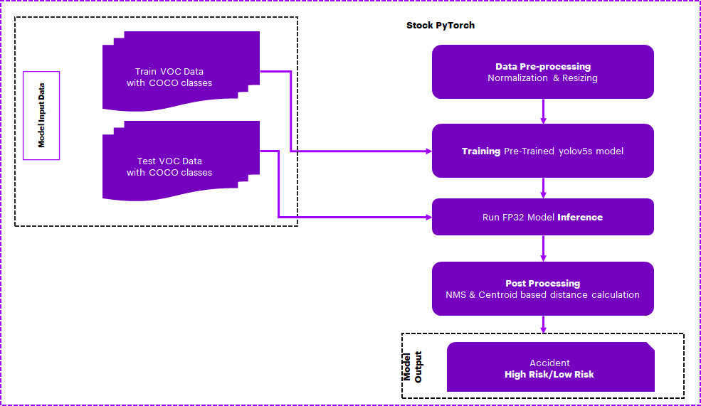
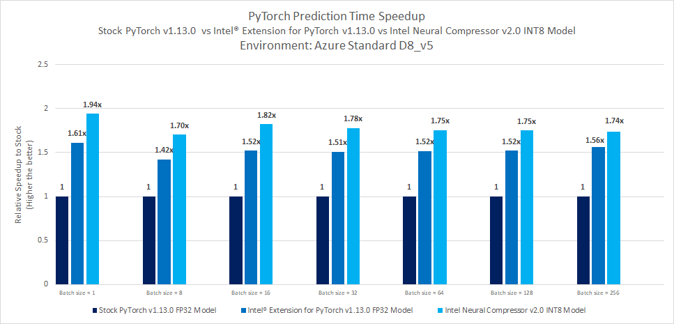
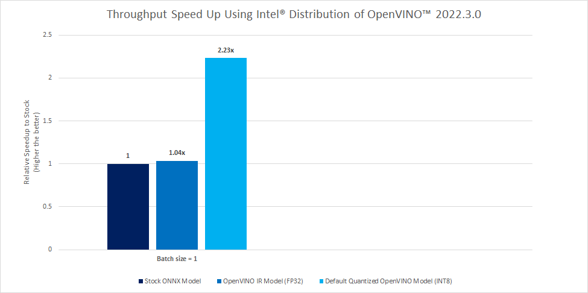

# **Traffic Camera Object Detection using PyTorch**

## Introduction
Traffic management is an important issue plaguing well-established and rapidly growing cities. Due to bad traffic management and accidents, there is a huge loss in productivity as people spend a lot of additional time on roads navigating traffic, which impacts performance at work and overall quality of life. Traffic accidents are dangerous and often result in fatalities. The time taken to respond to accidents and send medical aid depends on multiple human factors. Often a lack of timely response impacts the likelihood of survival.

## **Table of Contents**
 - [Purpose](#purpose)
 - [Reference Solution](#reference-solution)
 - [Reference Implementation](#reference-implementation)
 - [Intel® Optimized Implementation](#optimizing-the-e2e-solution-with-intel%C2%AE-oneapi-components)
 - [Performance Observations](#performance-observations)

 <!-- Purpose -->
## Purpose

Intelligent traffic management systems leveraging video surveillance, automated accident detection, and prediction solutions will go a long way in improving safety and traffic flow in cities. These solutions need to provide real-time insights and recommendations to be effective.
Cloud, Edge Computing, 5G, Artificial Intelligence (AI)/Deep Learning (DL), and Internet of Things (IoT) technologies form the core technology stack of intelligent traffic management systems. IP Cameras and Cloud-based communication between devices although effective solutions for traffic management, would introduce additional latency and bandwidth issues which could be detrimental in traffic management scenarios.

Leveraging the power of edge computing, communication between devices with very low latency can be achieved. A few example scenarios include traffic signals and vehicles exchanging information about pedestrians on crosswalks, communication between surveillance cameras and vehicles regarding proximity, and the possibility of an accident with very low latency; thus enabling preventive action in near real-time.
Deep Learning (DL) algorithms can predict traffic accidents based on live traffic camera feeds. Computer vision tasks and complex feature analysis can be accomplished easily with high performance by leveraging Deep Learning algorithms.
Artificial Intelligence (AI) based detection algorithms deployed at the edge enable real-time analytics of video feeds and detection of accidents and other issues, thus improving overall traffic management.

## Reference Solution

- AI-enabled traffic camera imaging aid helps address traffic management challenges by reducing congestion on road, improving the accuracy of pedestrian/vehicle identification, improving device-2-device communication, and helping reduce accidents.
- In this reference kit, we have created a general detection model that is capable of distinguishing objects that would be relevant to traffic cameras. We first preprocess a Pascal VOC dataset by combining it with COCO classes using OpenCV. We then perform a transfer learning approach using an advanced pre-trained real-time object detection YOLOv5 model, which is further trained to detect vehicles and pedestrians. After that, OpenCV and NumPy based postprocessing of Non-Maxima Suppression (NMS) and centroid-based distance calculation of detected objects is used to predict a possible collision, which could be used for example to warn vehicle drivers via device-2-device communication.
- Since GPUs are typically the choice for Deep Learning and AI processing to achieve a higher Frames Per Second (FPS) rate, to offer a more cost-effective option leveraging a CPU, we use the quantization technique, leveraging Intel Analytics toolkit, to achieve high FPS by performing vectorized operations on CPUs itself.
- By quantizing/compressing the model (from floating point to integer model), while maintaining a similar level of accuracy as the floating point model, we demonstrate efficient utilization of underlying resources when deployed on edge devices with low processing and memory capabilities.

## **Key Implementation Details**
- Highlighted the performance gain provided by Intel® Extension for PyTorch* v1.13.0 over the stock version of the PyTorch v1.13.0.<br>
- The dataset is first preprocessed using OpenCV and NumPy, and then NumPy based postprocessing is performed using Non-Maxima Suppression (NMS) and centroid-based distance calculations for possible collision detection.
- CNN-based YOLOV5 object detection model is a promising method to identify objects from the traffic camera. The time required for inference and the accuracy of the model are captured for multiple runs on the stock version as well on the Intel® oneAPI version. The average of these runs is considered and the comparison has been provided.
- Model has been quantized using Intel® Neural Compressor and Intel® Distribution of OpenVINO™ which has shown high-performance vectorized operations on Intel® platforms.

## Reference Implementation

### ***E2E Architecture***
### **Use Case E2E flow**


### Expected Input-Output

**Input**                                 | **Output** |
| :---: | :---: |
| Traffic Camera Live Feed          |  Detected Objects(Vehicle/Pedestrians) and Alarm(High Risk/Low Risk) for possible accident scenarios
|       |   

### Reference Sources
*Dataset*: http://host.robots.ox.ac.uk/pascal/VOC/voc2012/VOCtrainval_11-May-2012.tar<br>

*Case Study & Repo*: https://github.com/ultralytics/yolov5

### Notes
***Please see this dataset applicable license for terms and conditions. Intel®Corporation does not own the rights to this data set and does not confer any rights to it.***

### Repository clone and Anaconda installation

###  For cloning the repository  please execute below 

```
git clone https://github.com/oneapi-src/traffic-camera-object-detection
cd traffic-camera-object-detection
```

> **Note**: If you are beginning to explore the reference kits on client machines such as a windows laptop, go to the [Running on Windows](#running-on-windows) section to ensure you are all set and come back here

> **Note**: The performance measurements were captured on Xeon based processors. The instructions will work on WSL, however some portions of the ref kits may run slower on a client machine, so utilize the flags supported to modify the epochs/batch size to run the training or inference faster. Additionally performance claims reported may not be seen on a windows based client machine.

> **Note**: In this reference kit implementation already provides the necessary conda environment configurations to setup the software requirements. To utilize these environment scripts, first install Anaconda/Miniconda by following the instructions at the following link  
> [Anaconda installation](https://docs.anaconda.com/anaconda/install/linux/)

## Overview
### ***Software Requirements***
| **Package**                | **Stock Python**                
| :---                       | :---                            
| OpenCV     | opencv-python=4.5.5.64
| NumPy               | numpy=1.23.5
| PyTorch              | pytorch=1.13.0
| Intel® Extension for PyTorch         | NA                              
| Intel® Neural Compressor         | NA      
| Intel® Distribution of OpenVINO™ | NA                                                

### Environment

Below are the developer environment used for this module on Azure. All the observations captured are based on this environment setup.

**Size** | **CPU Cores** | **Memory**  | **Intel® CPU Family**
| :--- | :--: | :--: | :--:
| *Standard_D8_V5* | 8 | 32GB | ICELAKE

**YAML file**                                 | **Environment Name** |  **Configuration** |
| :---: | :---: | :---: |
| `env/stock/stock-pt.yml`             | `stock-pt` | Python v3.9 with stock PyTorch v1.13.0

### Dataset

| **Use case** | Automated methods to detect possible accidents from the stationary traffic camera
| :--- | :---
| **Object of interest** | Accident Detection in Autonomous Industry
| **Size** | Total 4952 Validation Images of Pascal VOC <br>
>**Note**: The dataset will be downloaded as part of the code and divided into folders for train and validation. For benchmarking, we make use of the Validation dataset.

## Usage and Instructions

Below are the steps to reproduce the benchmarking results given in this repository
1. Environment Creation
2. Dataset preparation
3. Training
4. Model Inference


### 1. Environment Creation

**Setting up the environment for Stock PyTorch**<br>Follow the below conda installation commands to set up the Stock PyTorch v1.13.0 environment for the model inferencing. 

```sh
conda env create -f env/stock/stock-pt.yml
```
*Activate stock conda environment*

Use the following command to activate the environment that was created:

```sh
conda activate stock-pt
```
### 2. Data preparation

> Data download is automated with the scripts.

The following steps need to be followed:
#### Cloning the repo

```sh
cd src
git clone https://github.com/ultralytics/yolov5.git
cd yolov5
git reset --hard 2f1eb21ad6c0f715f38200c31e6e01a92c5acb25

# Intel® Extension for PyTorch training patch
git apply --reject --whitespace=fix ../training.patch

# Copying required files to the cloned repo
cp ../data/VOC.yaml ./data/
cp ../deploy.yaml ./
cp ../run* ./
cp -r ../openvino ./
```
> ** Note: Going forward all experiments will be done inside the "yolov5" cloned folder**

```
Data downloading steps: 

1. Users can change the data download path in "src/yolov5/data/VOC.yaml" by default it is "../../data/VOC"

2. Data will be downloaded automatically through the script while running experiments.

```
<br>Folder structure looks as below after data downloaded.</br>
```
data/
└── VOC
    ├── images
    │   ├── VOCdevkit
    │   │   ├── VOC2007
    │   │   │   ├── Annotations
    │   │   │   ├── ImageSets
    │   │   │   │   ├── Layout
    │   │   │   │   ├── Main
    │   │   │   │   └── Segmentation
    │   │   │   ├── JPEGImages
    │   │   │   ├── SegmentationClass
    │   │   │   └── SegmentationObject
    │   │   └── VOC2012
    │   │       ├── Annotations
    │   │       ├── ImageSets
    │   │       │   ├── Action
    │   │       │   ├── Layout
    │   │       │   ├── Main
    │   │       │   └── Segmentation
    │   │       ├── JPEGImages
    │   │       ├── SegmentationClass
    │   │       └── SegmentationObject
    │   ├── test2007
    │   ├── train2007
    │   ├── train2012
    │   ├── val2007
    │   └── val2012
    └── labels
        ├── test2007
        ├── train2007
        ├── train2012
        ├── val2007
        └── val2012
```

### 3. Training
 Running training using Stock PyTorch v1.13.0 
> Activate Stock Environment before running

 ```
 usage: train.py [-h] [--weights WEIGHTS] [--cfg CFG] [--data DATA] [--hyp HYP] [--epochs EPOCHS]
                [--batch-size BATCH_SIZE] [--imgsz IMGSZ] [--rect] [--resume [RESUME]] [--nosave] [--noval]
                [--noautoanchor] [--noplots] [--evolve [EVOLVE]] [--bucket BUCKET] [--cache [CACHE]] [--image-weights]
                [--device DEVICE] [--multi-scale] [--single-cls] [--optimizer {SGD,Adam,AdamW}] [--sync-bn]
                [--workers WORKERS] [--project PROJECT] [--name NAME] [--exist-ok] [--quad] [--cos-lr]
                [--label-smoothing LABEL_SMOOTHING] [--patience PATIENCE] [--freeze FREEZE [FREEZE ...]]
                [--save-period SAVE_PERIOD] [--seed SEED] [--local_rank LOCAL_RANK] [--entity ENTITY]
                [--upload_dataset [UPLOAD_DATASET]] [--bbox_interval BBOX_INTERVAL] [--artifact_alias ARTIFACT_ALIAS]
                [--intel INTEL] [--bf16]

optional arguments:
  -h, --help            show this help message and exit
  --weights WEIGHTS     initial weights path
  --cfg CFG             model.yaml path
  --data DATA           dataset.yaml path
  --hyp HYP             hyperparameters path
  --epochs EPOCHS       total training epochs
  --batch-size BATCH_SIZE
                        total batch size for all GPUs, -1 for autobatch
  --imgsz IMGSZ, --img IMGSZ, --img-size IMGSZ
                        train, val image size (pixels)
  --rect                rectangular training
  --resume [RESUME]     resume most recent training
  --nosave              only save final checkpoint
  --noval               only validate final epoch
  --noautoanchor        disable AutoAnchor
  --noplots             save no plot files
  --evolve [EVOLVE]     evolve hyperparameters for x generations
  --bucket BUCKET       gsutil bucket
  --cache [CACHE]       --cache images in "ram" (default) or "disk"
  --image-weights       use weighted image selection for training
  --device DEVICE       cuda device, i.e. 0 or 0,1,2,3 or cpu
  --multi-scale         vary img-size +/- 50%
  --single-cls          train multi-class data as single-class
  --optimizer {SGD,Adam,AdamW}
                        optimizer
  --sync-bn             use SyncBatchNorm, only available in DDP mode
  --workers WORKERS     max dataloader workers (per RANK in DDP mode)
  --project PROJECT     save to project/name
  --name NAME           save to project/name
  --exist-ok            existing project/name ok, do not increment
  --quad                quad dataloader
  --cos-lr              cosine LR scheduler
  --label-smoothing LABEL_SMOOTHING
                        Label smoothing epsilon
  --patience PATIENCE   EarlyStopping patience (epochs without improvement)
  --freeze FREEZE [FREEZE ...]
                        Freeze layers: backbone=10, first3=0 1 2
  --save-period SAVE_PERIOD
                        Save checkpoint every x epochs (disabled if < 1)
  --seed SEED           Global training seed
  --local_rank LOCAL_RANK
                        Automatic DDP Multi-GPU argument, do not modify
  --entity ENTITY       Entity
  --upload_dataset [UPLOAD_DATASET]
                        Upload data, "val" option
  --bbox_interval BBOX_INTERVAL
                        Set bounding-box image logging interval
  --artifact_alias ARTIFACT_ALIAS
                        Version of dataset artifact to use
  --intel INTEL, -i INTEL
                        To Enable Intel Optimization set to 1, default 0
  --bf16                Enable only on Intel® Fourth Gen Xeon, BF16
 ```

> Note: The training code provided here is out of the box from the yolov5 repository, and its usage is described above.

**Command to run training**
```sh
cd src/yolov5 # should be inside the "yolov5" cloned repo folder ignore if already in "yolov5"
python train.py --weights yolov5s.pt --data ./data/VOC.yaml --epochs 10 -i 0
```
By default, trained model will be saved in "runs/train/exp{}/weights" folder.

### 4. Inference

 Running inference using Stock PyTorch v1.13.0 
> Activate Stock Environment before running
```
usage: run_inference.py [-h] [-c CONFIG] [-d DATA_YAML] [-b BATCHSIZE] [-w WEIGHTS] [-i INTEL] [-int8inc INT8INC] [-qw QUANT_WEIGHTS] [-si SAVE_IMAGE] [-sip SAVE_IMAGE_PATH]

optional arguments:
  -h, --help            show this help message and exit
  -c CONFIG, --config CONFIG
                        Yaml file for quantizing model, default is "./deploy.yaml"
  -d DATA_YAML, --data_yaml DATA_YAML
                        Absolute path to the data yaml file containing configurations
  -b BATCHSIZE, --batchsize BATCHSIZE
                        batchsize for the dataloader....default is 1
  -w WEIGHTS, --weights WEIGHTS
                        Model Weights ".pt" format
  -i INTEL, --intel INTEL
                        Run Intel optimization (Ipex) when 1....default is 0
  -int8inc INT8INC      Run INC quantization when 1....default is 0
  -qw QUANT_WEIGHTS, --quant_weights QUANT_WEIGHTS
                        Quantization Model Weights folder containing ".pt" format model
  -si SAVE_IMAGE, --save_image SAVE_IMAGE
                        Save images in the save image path specified if 1, default 0
  -sip SAVE_IMAGE_PATH, --save_image_path SAVE_IMAGE_PATH
                        Path to save images after post processing/ detected results
```
**Command to run inference**

```sh
cd src/yolov5 # should be inside the "yolov5" cloned repo folder ignore if already in "yolov5"
python run_inference.py -c ./deploy.yaml -d ./data/VOC.yaml -b 1 -w yolov5s.pt
```
>**Note** : <br>1. Users can pass the trained model "-w {trained model}" for inferencing by default pretrained model will be considered.</br>2. The above inference script can be run in the stock environment using different batch sizes "-b":{1/8/16/32/64/128/256}.<br>3. Users can enable flag "--save_image 1" and sepcify the output folder path "--save_image_path {path/to/folder}" to save the output images.</br>

## Optimizing the E2E solution with Intel® oneAPI components

### **Use Case E2E flow**


### **Optimized software components**
| **Package**                | **Intel® Distribution for Python**                
| :---                       | :---                            
| OpenCV     | opencv-python=4.5.5.64
| NumPy               | numpy=1.23.4
| PyTorch              | pytorch=1.13.0
| Intel® Extension for PyTorch         | intel-extension-for-pytorch=1.13.0                              
| Intel® Neural Compressor         | neural-compressor=2.0   
| Intel® Distribution of OpenVINO™ | openvino-dev=2022.3.0

### **Optimized Solution setup**

**YAML file**                                 | **Environment Name** |  **Configuration** |
| :---: | :---: | :---: |
`env/intel/intel-pt.yml`             | `intel-pt` | Python v3.9 with Intel® Extension for PyTorch v1.13.0 |

## Usage and Instructions
Below are the steps to reproduce the benchmarking results given in this repository
1. Environment Creation
2. Training
3. Model Inference
4. Quantize trained models using Intel® Neural Compressor and benchmarking
5. Quantize trained models using Intel® Distribution of OpenVINO™ and benchmarking

### 1. Environment Creation

**Setting up the environment for Intel® Extension for PyTorch**<br>Follow the below conda installation commands to setup the Intel® Extension for PyTorch environment for the model inferencing.
```sh
conda env create -f env/intel/intel-pt.yml
```
>**Note**: Users should run above command from cloned git repo **"traffic-camera-object-detection".**

*Activate Intel® conda environment*

Use the following command to activate the environment that was created:

```sh
conda activate intel-pt 
```
>**Note**: Users can use same environment for Quantization using Intel® Neural Compressor

### 2. Training

**Command to run training with Intel® Extension for PyTorch**

```sh
cd src/yolov5 # should be inside the "yolov5" cloned repo folder ignore if already in "yolov5"
python train.py --weights yolov5s.pt --data ./data/VOC.yaml --epochs 10 -i 1
```
By default, trained model will be saved in "runs/train/exp{}/weights" folder.

The **train.py** script also includes a command line flag --bf16 which enables bf16 mixed precision training (on CPUs that support it) along with the optimizations.

The training process for Intel® Extension for PyTorch* along with bf16 mixed precision training can be enabled using the **train.py** script as:

>**Note**: You can enable bf16 training by setting the bf16 flag as shown below. Please note that this flag MUST be enabled only on Intel® Fourth Gen Xeon® Scalable processors codenamed Sapphire Rapids that has bf16 training support and optimizations to utilize AMX, the latest ISA introduced in this family of processors.

```sh
cd src/yolov5 # should be inside the "yolov5" cloned repo folder ignore if already in "yolov5"
python train.py --weights yolov5s.pt --data ./data/VOC.yaml --epochs 10 --bf16
```

### 3. Inference

Running inference using Intel® Extension for PyTorch v1.13.0 
> Activate Intel® Environment before running
```
usage: run_inference.py [-h] [-c CONFIG] [-d DATA_YAML] [-b BATCHSIZE] [-w WEIGHTS] [-i INTEL] [-int8inc INT8INC] [-qw QUANT_WEIGHTS] [-si SAVE_IMAGE] [-sip SAVE_IMAGE_PATH]

optional arguments:
  -h, --help            show this help message and exit
  -c CONFIG, --config CONFIG
                        Yaml file for quantizing model, default is "./deploy.yaml"
  -d DATA_YAML, --data_yaml DATA_YAML
                        Absolute path to the data yaml file containing configurations
  -b BATCHSIZE, --batchsize BATCHSIZE
                        batchsize for the dataloader....default is 1
  -w WEIGHTS, --weights WEIGHTS
                        Model Weights ".pt" format
  -i INTEL, --intel INTEL
                        Run Intel optimization (Ipex) when 1....default is 0
  -int8inc INT8INC      Run INC quantization when 1....default is 0
  -qw QUANT_WEIGHTS, --quant_weights QUANT_WEIGHTS
                        Quantization Model Weights folder containing ".pt" format model
  -si SAVE_IMAGE, --save_image SAVE_IMAGE
                        Save images in the save image path specified if 1, default 0
  -sip SAVE_IMAGE_PATH, --save_image_path SAVE_IMAGE_PATH
                        Path to save images after post processing/ detected results
```
**Command to run inference**

```sh
cd src/yolov5 # should be inside the "yolov5" cloned repo folder ignore if already in "yolov5"
python run_inference.py -c ./deploy.yaml -d ./data/VOC.yaml -b 1 -w yolov5s.pt -i 1
```
>**Note**:<br>1. Above inference script can be run in an Intel® environment using different batch sizes "-b":{1/8/16/32/64/128/256}.<br>2. Users can enable flag "--save_image 1" and sepcify the output folder path "--save_image_path {path/to/folder}" to save the output images.</br>

### 4. Quantize trained models using Intel® Neural Compressor

Intel® Neural Compressor is used to quantize the FP32 Model to the INT8 Model. Optimized model is used here for evaluating and timing Analysis.
Intel® Neural Compressor supports many optimization methods. In this case, we used post-training quantization with the `Accuracy aware mode` method to quantize the FP32 model.

Step-1: Conversion of FP32 Model to INT8 Model

```
usage: run_inc_quantization.py [-h] [-o OUTPATH] [-c CONFIG] [-d DATA_YAML] [-w WEIGHTS]

optional arguments:
  -h, --help            show this help message and exit
  -o OUTPATH, --outpath OUTPATH
                        absolute path to save quantized model. By default it will be saved in "./inc_compressed_model/output" folder
  -c CONFIG, --config CONFIG
                        Yaml file for quantizing model, default is "./deploy.yaml"
  -d DATA_YAML, --data_yaml DATA_YAML
                        Absolute path to the data yaml file containing configurations
  -w WEIGHTS, --weights WEIGHTS
                        Model Weights ".pt" format
```

**Command to run the neural_compressor_conversion **
> Activate Intel® Environment before running
```
cd src/yolov5 # should be inside "yolov5" cloned repo folder ignore if already in "yolov5"
python run_inc_quantization.py
```
> Quantized model will be saved by default in `./inc_compressed_model/output` folder as `best_model.pt`

Step-2: Inferencing using quantized Model

**Command to run inference **
```
cd src/yolov5 # should be inside the "yolov5" cloned repo folder ignore if already in "yolov5"
python run_inference.py -c ./deploy.yaml -d ./data/VOC.yaml -b 1 -w yolov5s.pt -int8inc 1
```
>**Note**: <br>1. Above inference script can be run in Intel® environment using different batch sizes "-b":{1/8/16/32/64/128/256}<br>2. Users can enable flag "--save_image 1" and sepcify the output folder path "--save_image_path {path/to/folder}" to save the output images.</br>

#### 5. **Using Intel® Distribution of OpenVINO™**
When it comes to the deployment of this model on Edge devices, with less computing and memory resources, we further need to explore 
options for quantizing and compressing the model which brings out the same level of accuracy and efficient utilization of underlying 
computing resources. Intel® Distribution of OpenVINO™ Toolkit facilitates the optimization of a deep learning model from a framework 
and deployment using an inference engine on such computing platforms based on Intel hardware accelerators. This section covers the steps 
to use this toolkit for model quantization and measure its performance.

>Note: Users can use the intel environment for performing benchmarking with **Intel® Distribution of OpenVINO**

> Activate Intel® Environment before running

#### Model conversion to OpenVINO Intermediate Representation (IR) conversion
Below script is used to convert FP32 model to ONNX model representation. By default, the converted onnx model file will be saved in
openvino/openvino_models/openvino_onnx.

```
usage: convert_to_onnx.py [-h] [-o OUTPATH] [-w WEIGHTS] [-mname MODEL_NAME]

optional arguments:
  -h, --help            show this help message and exit
  -o OUTPATH, --outpath OUTPATH
                        absolute path to save converted model. By default it will be saved in "./openvino/openvino_models/openvino_onnx" folder
  -w WEIGHTS, --weights WEIGHTS
                        Model Weights in ".pt" format
  -mname MODEL_NAME, --model_name MODEL_NAME
                        Name of the model to be created in ".onnx" format, default "TrafficOD"
```

<b>Example</b>
```sh
python openvino/convert_to_onnx.py
```
The converted model will be saved to the openvino/openvino_models/openvino_onnx in .onnx format.

Below command is used to convert the onnx model to OpenVINO IR model format.
```sh
mo --input_model <onnx model> --output_dir <output dir path to save the IR model>
```
Arguments
```
--input_model     onnx model
--output_dir      path of the folder to save the OpenVINO IR model format
```
The above command will generate `<model-name>.bin` and `<model-name>.xml` as output which can be used for OpenVINO inference. Default precision is FP32.

<b>Example</b>
```sh
mo --input_model ./openvino/openvino_models/openvino_onnx/TrafficOD_Onnx_Model.onnx --output_dir ./openvino/openvino_models/openvino_ir
```

#### Model Performance with OpenVINO Post-Training Optimization Tool
Post-training Optimization Tool (POT) is designed to accelerate the inference of deep learning models by applying special methods without model 
retraining or fine-tuning. One such method is post-training quantization.

Below command is used to run the benchmark tool for the ONNX model generated. 

```sh
benchmark_app -m <path of onnx model>
```

Argument
```
-m,--modelpath   path of model in onnx format
```
<b>Example</b>
```sh
benchmark_app -m ./openvino/openvino_models/openvino_onnx/TrafficOD_Onnx_Model.onnx -api async -niter 120 -nireq 1 -b 1 -nstreams 1 -nthreads 8 -hint none
```

Below command is used to run the benchmark tool for the OpenVINO IR model. 
```sh
benchmark_app -m <Path of the OpenVINO IR modell in xml format>
```
Argument
```
-m,--modelpath   Path of model in OpenVINO IR model in xml format
```
<b>Example</b>
```sh
benchmark_app -m ./openvino/openvino_models/openvino_ir/TrafficOD_Onnx_Model.xml -api async -niter 120 -nireq 1 -b 1 -nstreams 1 -nthreads 8 -hint none
```
#### Model Conversion Using OpenVino Quantization
Below script is used to convert OpenVINO IR model to OpenVINO INT8 model representation. By default, the converted OpenVINO INT8 model will be saved in
openvino/openvino_models/openvino_quantized.

```
usage: openvino_quantization.py [-h] [-m FPIR_MODELPATH] [-o OUTPATH] [-d DATA_YAML] [-b BATCHSIZE]

optional arguments:
  -h, --help            show this help message and exit
  -m FPIR_MODELPATH, --FPIR_modelpath FPIR_MODELPATH
                        FP32 IR Model absolute path without extension
  -o OUTPATH, --outpath OUTPATH
                        default output quantized model will be save in path specified by outpath
  -d DATA_YAML, --data_yaml DATA_YAML
                        Absolute path to the yaml file containing paths data/ download data
  -b BATCHSIZE, --batchsize BATCHSIZE
                        batch size used for loading the data
```

<b>Example</b>
```sh
python openvino/openvino_quantization.py
```
After running the above command, we can verify that "<model-name>.bin", "<model-name>.xml", "<model-name>.mapping" files (quantized model) got generated on "openvino/openvino_models/openvino_quantized" path.

Note> At the end Users can also observe the evaluation score of OpenVINO IR FP32 model as well as OpenVINO INT8 model.

##### Model Performance Using Quantized (INT8) Model
Use the below command to run the benchmark tool for the Quantized OpenVINO IR model.

```sh
benchmark_app -m <quantized POT model in xml format>
```

Argument
```
-m,--quantizedmodelpath   Quantized POT model in xml format
```
<b>Example</b>
```sh
benchmark_app -m ./openvino/openvino_models/openvino_quantized/torch_jit.xml -api async -niter 120 -nireq 1 -b 1 -nstreams 1 -nthreads 8 -hint none
```

## Performance Observations
 
### Observations
This section covers the inference time comparison between Stock PyTorch v1.13.0 and Intel® Extension for PyTorch v1.13.0 for this model building.

#### Inference benchmarking results



<br>**Key Takeaways**<br>

-  Realtime prediction time speedup with Intel® Extension for PyTorch v1.13.0 FP32 Model shows up to 1.61x against Stock PyTorch v1.13.0 FP32 Model
-  Batch prediction time speedup with Intel® Extension for PyTorch v1.13.0 FP32 Model shows up to 1.56x against Stock PyTorch v1.13.0 FP32 Model
-  Intel® Neural Compressor quantization offers Realtime prediction time speedup up to  1.94x against Stock PyTorch v1.13.0  FP32 model
-  Intel® Neural Compressor quantization offers batch prediction time speedup up to 1.82x against Stock PyTorch v1.13.0 FP32 model.
-  Accuracy drop observed up to 0.01%.



- Full precision ONNX Model (FP32)
    - Throughput: **27.33 FPS**
- Full precision IR Model (FP32)
    - Throughput: **28.33 FPS**
- Quantized IR Model (INT8 with DefaultQuantization)
    - Throughput: **61.05 FPS**

<br>**Takeaway**<br>Intel® Distribution of OpenVINO™ full precision IR (FP32) model offers FPS speed-up of around 1.04x and quantized IR (INT8) model with default quantization
offers FPS speed-up of 2.23x compared to full precision ONNX model.

## Appendix

### **Running on Windows**

The reference kits commands are linux based, in order to run this on Windows, goto Start and open WSL and follow the same steps as running on a linux machine starting from git clone instructions. If WSL is not installed you can [install WSL](https://learn.microsoft.com/en-us/windows/wsl/install).

> **Note** If WSL is installed and not opening, goto Start ---> Turn Windows feature on or off and make sure Windows Subsystem for Linux is checked. Restart the system after enabling it for the changes to reflect.

### **Experiment setup**

- Testing performed on: January 2023
- Testing performed by: Intel Corporation

| Platform                          | Microsoft Azure: Standard_D8_v5 (Ice Lake)<br>Ubuntu 20.04
| :---                              | :---
| Hardware                          | Azure Standard_D8_V5
| Software                          | Intel® oneAPI AI Analytics Toolkit, Intel® Extension for PyTorch v1.13.0, Intel® Neural Compressor v2.0, Intel® Distribution of OpenVINO™ v2022.3.0
| What you will learn               | Advantage of using Intel® Extension for PyTorch v1.13.0 over the stock PyTorch v1.13.0.


### Known Issues

1. Common prerequisites required to run python scripts in linux system.
    Install gcc and curl.  For Ubuntu, this will be: 

      ```bash
      apt-get update
      apt-get install curl
      apt-get install gcc
      apt-get install git
      ```

2. ImportError: libGL.so.1: cannot open shared object file: No such file or directory
   
    **Issue:**
      ```
      ImportError: libGL.so.1: cannot open shared object file: No such file or directory
      or
      libgthread-2.0.so.0: cannot open shared object file: No such file or directory
      ```

    **Solution:**

      Install the libgl1 and libglib2.0-0 libraries. For Ubuntu this will be:

      ```bash
     sudo apt install libgl1
     sudo apt install libglib2.0-0
      ```
