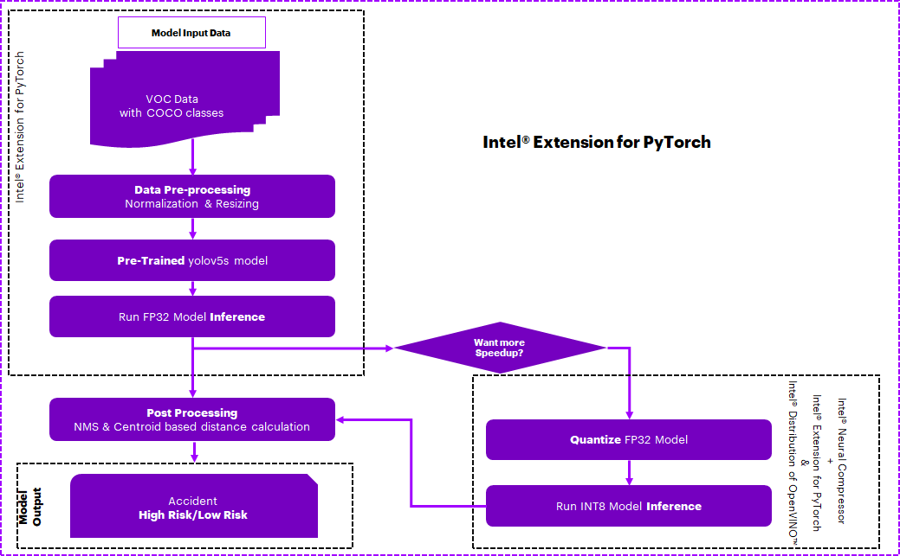
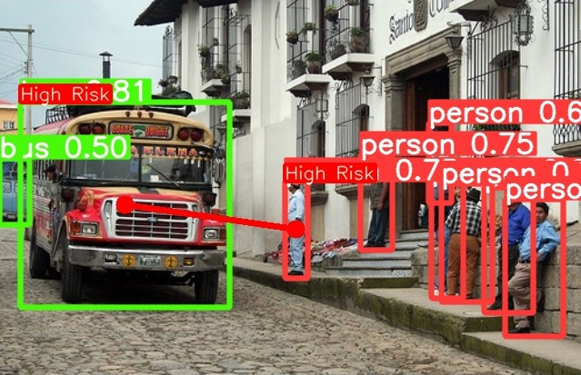

# Traffic Camera Object Detection

## Introduction

This reference kit provides an end-to-end (E2E) Machine Learning (ML) workflow for traffic management using Pytorch*, [Intel® Neural Compressor](https://www.intel.com/content/www/us/en/developer/tools/oneapi/neural-compressor.html), [OpenVINO*](https://github.com/openvinotoolkit/openvino) and [Intel® Optimizations for PyTorch*](https://www.intel.com/content/www/us/en/developer/tools/oneapi/optimization-for-pytorch.html). Traffic management is an important issue plaguing well-established and rapidly growing cities. Bad traffic management and accidents impact performance at work, but mainly quality of life.

Check out more workflow examples in the [Developer Catalog](https://developer.intel.com/aireferenceimplementations).

## Solution Technical Overview

Traffic accidents are dangerous and often result in fatalities. The time taken to respond to accidents and send medical aid depends on multiple human factors. Often a lack of timely response impacts the likelihood of survival.

Intelligent traffic management systems leveraging video surveillance, automated accident detection, and prediction solutions will go a long way in improving safety and traffic flow in cities. These solutions need to provide real-time insights and recommendations to be effective.

Leveraging the power of edge computing, communication between devices with very low latency can be achieved. An example scenario includes traffic signals and vehicles exchanging information about pedestrians on crosswalks, communication between surveillance cameras and vehicles regarding proximity, and the possibility of an accident with very low latency; thus enabling preventive action in near real-time.

Deep Learning (DL) algorithms can predict traffic accidents based on live traffic camera feeds. Computer vision tasks and complex feature analysis can be accomplished easily with high performance by leveraging DL algorithms.

Artificial Intelligence (AI) based detection algorithms deployed at the edge enable real-time analytics of video feeds and detection of accidents and other issues, thus improving overall traffic management. AI-enabled traffic camera imaging aid helps address traffic management challenges by reducing congestion on road, improving the accuracy of pedestrian/vehicle identification, improving device-2-device communication, and helping reduce accidents.

This workflow implementation is a reference solution to the described use case that includes an optimized reference E2E architecture enabled with [Intel® Optimizations for PyTorch*](https://www.intel.com/content/www/us/en/developer/tools/oneapi/optimization-for-pytorch.html#gs.1sivqb) and [Intel® Neural Compressor](https://www.intel.com/content/www/us/en/developer/tools/oneapi/neural-compressor.html#gs.1sixws) available as part of [Intel® AI Tools](https://www.intel.com/content/www/us/en/developer/tools/oneapi/ai-analytics-toolkit.html#gs.1sgo4k) optimizations and [OpenVINO*](https://github.com/openvinotoolkit/openvino):

* **Intel® Optimizations for PyTorch***

  PyTorch* is an AI and machine learning framework popular for both research and production usage. This open source library is often used for deep learning applications whose compute-intensive training and inference test the limits of available hardware resources. Intel releases its newest optimizations and features in Intel® Optimizations for PyTorch* before upstreaming them into open source PyTorch.

* **Intel® Neural Compressor**

  [Intel® Neural Compressor](https://www.intel.com/content/www/us/en/developer/tools/oneapi/neural-compressor.html) performs model compression to reduce the model size and increase the speed of deep learning inference for deployment on CPUs or GPUs. This open source Python* library automates popular model compression technologies, such as quantization, pruning, and knowledge distillation across multiple deep learning frameworks.

* **OpenVINO***

  [OpenVINO*](https://github.com/openvinotoolkit/openvino) is an open-source toolkit for optimizing and deploying AI inference.

  * Boost deep learning performance in computer vision, automatic speech recognition, natural language processing and other common tasks.
  * Use models trained with popular frameworks like TensorFlow, PyTorch and more.
  * Reduce resource demands and efficiently deploy on a range of Intel® platforms from edge to cloud.

## Solution Technical Details

### Dataset

The dataset to be used is the [Pascal VOC dataset](http://host.robots.ox.ac.uk/pascal/VOC/index.html). It will be downloaded automatically when running the `train.py` script and divided into folders for training and validation.

The training data consists of a set of images; each image has an annotation file giving a bounding box and object class label for each object in one of the twenty classes present in the image. Multiple objects from multiple classes may be present in the same image.

>***Note:*** Please see this dataset applicable license for terms and conditions. Intel®Corporation does not own the rights to this dataset and does not confer any rights to it.

Folder structure looks as below after data downloaded:

```text
data/
  ├── images
  │   ├── VOCdevkit
  │   │   ├── VOC2007
  │   │   │   ├── Annotations
  │   │   │   ├── ImageSets
  │   │   │   │   ├── Layout
  │   │   │   │   ├── Main
  │   │   │   │   └── Segmentation
  │   │   │   ├── JPEGImages
  │   │   │   ├── SegmentationClass
  │   │   │   └── SegmentationObject
  │   │   └── VOC2012
  │   │       ├── Annotations
  │   │       ├── ImageSets
  │   │       │   ├── Action
  │   │       │   ├── Layout
  │   │       │   ├── Main
  │   │       │   └── Segmentation
  │   │       ├── JPEGImages
  │   │       ├── SegmentationClass
  │   │       └── SegmentationObject
  │   ├── test2007
  │   ├── train2007
  │   ├── train2012
  │   ├── val2007
  │   └── val2012
  └── labels
      ├── test2007
      ├── train2007
      ├── train2012
      ├── val2007
      └── val2012
```

## Validated Hardware Details

[Intel® oneAPI](https://www.intel.com/content/www/us/en/developer/tools/oneapi/overview.html) is used to achieve quick results even when the data for a model is huge. It provides the capability to reuse the code present in different languages so that the hardware utilization is optimized to provide these results.

| Recommended Hardware                                            | Precision
| ----------------------------------------------------------------|-----------
| CPU: Intel® 2nd Gen Xeon® Platinum 8280 CPU @ 2.70GHz or higher | FP32, INT8, BF16
| RAM: 187 GB                                                     |
| Recommended Free Disk Space: 20 GB or more                      |

>***Note:*** BF16 can be enabled on Intel® Fourth Gen Xeon®, previous generations of Xeon® might not be compatible.

Code was tested on Ubuntu\* 22.04 LTS.


## How it Works

The following diagram shows the traffic camera object detection E2E workflow:



The following is an example of expected input and output:

**Input**                                 | **Output** |
| :---: | :---: |
| Traffic Camera Live Feed          |  Detected Objects(Vehicle/Pedestrians) and Alarm(High Risk/Low Risk) for possible accident scenarios
|       |  

### Intelligent Traffic Management

This reference kit uses a general detection model capable of distinguishing objects that would be relevant to traffic cameras. It preprocesses a Pascal VOC dataset by combining it with COCO classes using OpenCV*. A transfer learning approach is performed using an advanced pre-trained real-time object detection YOLOv5 model, which is further trained to detect vehicles and pedestrians. The dataset is first preprocessed using OpenCV* and NumPy, and then NumPy based postprocessing is performed using Non-Maxima Suppression (NMS) and centroid-based distance calculations for possible collision detection, which could be used for example to warn vehicle drivers via device-2-device communication.

Since GPUs are typically the choice for Deep Learning and AI processing to achieve a higher Frames Per Second (FPS) rate, to offer a more cost-effective option leveraging a CPU, we use the quantization technique, leveraging [Intel® AI Tools](https://www.intel.com/content/www/us/en/developer/tools/oneapi/ai-analytics-toolkit.html#gs.1sgmnd), to achieve high FPS by performing vectorized operations on CPUs itself.

By quantizing/compressing the model (from floating point to integer model), while maintaining a similar level of accuracy as the floating point model, we demonstrate efficient utilization of underlying resources when deployed on edge devices with low processing and memory capabilities.
Model has been quantized using Intel® Neural Compressor and Intel® Distribution of OpenVINO* which has shown high-performance vectorized operations on Intel® platforms.

### Get Started

Start by defining an environment variable that will store the workspace path, these directories will be created in further steps and will be used for all the commands executed using absolute paths.

[//]: # (capture: baremetal)
```bash
export WORKSPACE=$PWD/traffic-camera-object-detection
export DATA_DIR=$WORKSPACE/data
export OUTPUT_DIR=$WORKSPACE/output
export CONFIG_DIR=$WORKSPACE/config
export YOLO_DIR=$WORKSPACE/src/yolov5
```

### Download the Workflow Repository

Create a working directory for the workflow and clone the [main repository](https://github.com/oneapi-src/traffic-camera-object-detection) into your working directory.

[//]: # (capture: baremetal)
```bash
mkdir -p $WORKSPACE && cd $WORKSPACE
```

```bash
git clone https://github.com/oneapi-src/traffic-camera-object-detection.git $WORKSPACE
```

[//]: # (capture: baremetal)
```bash
mkdir -p $DATA_DIR $OUTPUT_DIR/models $OUTPUT_DIR/images $YOLO_DIR
```

### Set Up Conda

To learn more, please visit [install anaconda on Linux](https://docs.anaconda.com/free/anaconda/install/linux/).

```bash
wget https://repo.anaconda.com/miniconda/Miniconda3-latest-Linux-x86_64.sh
bash Miniconda3-latest-Linux-x86_64.sh
rm Miniconda3-latest-Linux-x86_64.sh
```

### Set Up Environment

The conda environment dependencies are kept in `$WORKSPACE/env/intel_env.yml`.

| **Package** | **Version**
| :---        | :---
| python | 3.9
| opencv | 4.8.0
| intel-aikit-pytorch | 2024.0
| neural-compressor | 2.3.1
| torchvision | 0.15.2
| seaborn | 0.13.0
| tqdm | 4.66.1
| tensorboard | 2.15.1
| pillow | 10.0.1
| ultralytics | 8.0.227
| gitpython | 3.1.40
| pip | 23.3.1
| opencv-python-headless | 4.8.1.78
| thop | 0.1.1-2209072238
| ipython | 8.18.1
| openvino-dev[pytorch,onnx] | 2023.2.0
| onnx | 1.14.1

To install the conda environment follow the next instructions:

```bash
# If you have conda 23.10.0 or greater you can skip the following two lines
# since libmamba is already set as the default solver.
conda install -n base conda-libmamba-solver -y
conda config --set solver libmamba
conda env create -f $WORKSPACE/env/intel_env.yml
```

Environment setup is required only once. Make sure no conda environment exists with the same name since this step does not cleanup/overwrite the existing environment. During this setup a new conda environment will be created with the dependencies listed in the YAML file.

Once the appropriate environment is created, activate it using the conda command given below:

```bash
conda activate traffic_detection_intel
```

## Download the Datasets

Data will be downloaded automatically through the script while running `train.py`; users can change the data download path by setting the value of `$DATA_DIR`. In order to download the datasets `curl` must be installed.

```bash
sudo apt install curl -y
```

## Supported Runtime Environment

You can execute the reference pipeline using the following environments:

* Bare Metal

---

### Run Using Bare Metal

#### Set Up System Software

Our examples use the `conda` package and environment on your local computer. If you don't already have `conda` installed or the `conda` environment created, go to [Set Up Conda*](#set-up-conda) or see the [Conda* Linux installation instructions](https://docs.conda.io/projects/conda/en/stable/user-guide/install/linux.html).

### Run Workflow

YOLOv5 is needed to run the workflow, download it by executing the following instructions:

[//]: # (capture: baremetal)
```bash
git clone https://github.com/ultralytics/yolov5.git $YOLO_DIR
cd $YOLO_DIR
git reset --hard 63555c8e2230328585d09fdc50a6601822a70ded

# Intel® Extension for PyTorch training patch
git apply --reject --whitespace=fix $CONFIG_DIR/training.patch

# Copying required files to the cloned repo
cp $CONFIG_DIR/data/VOC.yaml $YOLO_DIR/data/
cp $CONFIG_DIR/deploy.yaml $YOLO_DIR
cp $WORKSPACE/src/run* $YOLO_DIR
cp -r $WORKSPACE/src/openvino $YOLO_DIR

#Changes default data download path from `../data/VOC` to `$DATA_DIR`.
sed -i "s+../data/VOC+$DATA_DIR+g" $YOLO_DIR/data/VOC.yaml
```

### Training

To start training run `train.py` python script inside `src/yolov5`. The script downloads the dataset, preprocesses it and runs the training routine. The trained model will be saved in `output/models/train/exp{}/weights` folder.

```txt
usage: train.py [-h] [--weights WEIGHTS] [--cfg CFG] [--data DATA] [--hyp HYP] [--epochs EPOCHS] [--batch-size BATCH_SIZE] [--imgsz IMGSZ]
                [--rect] [--resume [RESUME]] [--nosave] [--noval] [--noautoanchor] [--noplots] [--evolve [EVOLVE]] [--bucket BUCKET]
                [--cache [CACHE]] [--image-weights] [--device DEVICE] [--multi-scale] [--single-cls] [--optimizer {SGD,Adam,AdamW}]
                [--sync-bn] [--workers WORKERS] [--project PROJECT] [--name NAME] [--exist-ok] [--quad] [--cos-lr]
                [--label-smoothing LABEL_SMOOTHING] [--patience PATIENCE] [--freeze FREEZE [FREEZE ...]] [--save-period SAVE_PERIOD]
                [--seed SEED] [--local_rank LOCAL_RANK] [--entity ENTITY] [--upload_dataset [UPLOAD_DATASET]]
                [--bbox_interval BBOX_INTERVAL] [--artifact_alias ARTIFACT_ALIAS] [--bf16]

optional arguments:
  -h, --help            show this help message and exit
  --weights WEIGHTS     initial weights path
  --cfg CFG             model.yaml path
  --data DATA           dataset.yaml path
  --hyp HYP             hyperparameters path
  --epochs EPOCHS       total training epochs
  --batch-size BATCH_SIZE
                        total batch size for all GPUs, -1 for autobatch
  --imgsz IMGSZ, --img IMGSZ, --img-size IMGSZ
                        train, val image size (pixels)
  --rect                rectangular training
  --resume [RESUME]     resume most recent training
  --nosave              only save final checkpoint
  --noval               only validate final epoch
  --noautoanchor        disable AutoAnchor
  --noplots             save no plot files
  --evolve [EVOLVE]     evolve hyperparameters for x generations
  --bucket BUCKET       gsutil bucket
  --cache [CACHE]       image --cache ram/disk
  --image-weights       use weighted image selection for training
  --device DEVICE       cuda device, i.e. 0 or 0,1,2,3 or cpu
  --multi-scale         vary img-size +/- 50%
  --single-cls          train multi-class data as single-class
  --optimizer {SGD,Adam,AdamW}
                        optimizer
  --sync-bn             use SyncBatchNorm, only available in DDP mode
  --workers WORKERS     max dataloader workers (per RANK in DDP mode)
  --project PROJECT     save to project/name
  --name NAME           save to project/name
  --exist-ok            existing project/name ok, do not increment
  --quad                quad dataloader
  --cos-lr              cosine LR scheduler
  --label-smoothing LABEL_SMOOTHING
                        Label smoothing epsilon
  --patience PATIENCE   EarlyStopping patience (epochs without improvement)
  --freeze FREEZE [FREEZE ...]
                        Freeze layers: backbone=10, first3=0 1 2
  --save-period SAVE_PERIOD
                        Save checkpoint every x epochs (disabled if < 1)
  --seed SEED           Global training seed
  --local_rank LOCAL_RANK
                        Automatic DDP Multi-GPU argument, do not modify
  --entity ENTITY       Entity
  --upload_dataset [UPLOAD_DATASET]
                        Upload data, "val" option
  --bbox_interval BBOX_INTERVAL
                        Set bounding-box image logging interval
  --artifact_alias ARTIFACT_ALIAS
                        Version of dataset artifact to use
  --bf16                Enable only on Intel® Fourth Gen Xeon, BF16
```

An example of how to use the above command is provided in the following code block. It will automatically download the dataset and `yolov5s.pt` model, preprocess the dataset, run the training script for 10 epochs using the values stored in `yolov5s.pt` for fine-tunning and `$YOLO_DIR/data/VOC.yaml` as configuration parameters. Output models will be stored at `$OUTPUT_DIR/models/train`.

[//]: # (capture: baremetal)
```bash
python $YOLO_DIR/train.py --weights $OUTPUT_DIR/models/yolov5s.pt --data $YOLO_DIR/data/VOC.yaml --epochs 10 --project $OUTPUT_DIR/models/train
```

`train.py` script also includes a command line flag `--bf16` that enables bf16 mixed precision training (on CPUs that support it) along with the optimizations.

The training process for Intel® Optimizations for PyTorch* along with bf16 mixed precision training can be enabled using the `train.py` script as:

```bash
python $YOLO_DIR/train.py --weights $OUTPUT_DIR/models/yolov5s.pt --data $YOLO_DIR/data/VOC.yaml --epochs 10 --project $OUTPUT_DIR/models/train --bf16
```

>***Note***: You can enable bf16 training by setting the bf16. Please note that this flag MUST be enabled only on Intel® Fourth Gen Xeon® Scalable processors codenamed Sapphire Rapids that has bf16 training support and optimizations to utilize AMX, the latest ISA introduced in this family of processors.

### Inference

To run inference use the `run_inference.py` python script inside `src/yolov5`.

```txt
usage: run_inference.py [-h] [-c CONFIG] [-d DATA_YAML] [-b BATCHSIZE] [-w WEIGHTS] [-int8inc] [-qw QUANT_WEIGHTS] [-si]
                        [-sip SAVE_IMAGE_PATH]

optional arguments:
  -h, --help            show this help message and exit
  -c CONFIG, --config CONFIG
                        Yaml file for quantizing model, default is "./deploy.yaml"
  -d DATA_YAML, --data_yaml DATA_YAML
                        Absolute path to the data yaml file containing configurations
  -b BATCHSIZE, --batchsize BATCHSIZE
                        batchsize for the dataloader....default is 1
  -w WEIGHTS, --weights WEIGHTS
                        Model Weights ".pt" format
  -int8inc              Run INC quantization when present
  -qw QUANT_WEIGHTS, --quant_weights QUANT_WEIGHTS
                        Quantization Model Weights folder containing ".pt" format model
  -si, --save_image     Save images in the specified save_image_path when present.
  -sip SAVE_IMAGE_PATH, --save_image_path SAVE_IMAGE_PATH
                        Path to save images after post processing/ detected results
```

An example of how to use the inference script is provided in the following code block. The script can be run in an Intel® environment using different batch sizes `-b`:{1/8/16/32/64/128/256}. To set the output folder path to save the output images `--save_image` and `--save_image_path {path/to/folder}` must be specified.

[//]: # (capture: baremetal)
```bash
python $YOLO_DIR/run_inference.py -c $CONFIG_DIR/deploy.yaml -d $YOLO_DIR/data/VOC.yaml -b 1 -w $OUTPUT_DIR/models/yolov5s.pt --save_image --save_image_path $OUTPUT_DIR/images/fp32
```

### Quantize trained models using Intel® Neural Compressor

Intel® Neural Compressor is used to quantize the FP32 Model to the INT8 Model. Optimized model is used here for evaluating and timing analysis.
Intel® Neural Compressor supports many optimization methods, for this case post-training quantization with the `Accuracy Aware Mode` method is used to quantize the FP32 model.

#### Step-1: Conversion of FP32 Model to INT8 Model

```txt
usage: run_inc_quantization.py [-h] [-o OUTPATH] [-c CONFIG] [-d DATA_YAML] [-w WEIGHTS]

optional arguments:
  -h, --help            show this help message and exit
  -o OUTPATH, --outpath OUTPATH
                        absolute path to save quantized model. By default it will be saved in "./inc_compressed_model/output" folder
  -c CONFIG, --config CONFIG
                        Yaml file for quantizing model, default is "./deploy.yaml"
  -d DATA_YAML, --data_yaml DATA_YAML
                        Absolute path to the data yaml file containing configurations
  -w WEIGHTS, --weights WEIGHTS
                        Model Weights ".pt" format
```

An example of how to quantize trained models is provided in the following code block. Quantized model will be saved by default in `$OUTPUT_DIR/models/inc_compressed_model/` folder as `best_model.pt`

[//]: # (capture: baremetal)
```bash
python $YOLO_DIR/run_inc_quantization.py -o $OUTPUT_DIR/models/inc_compressed_model/ -c $CONFIG_DIR/deploy.yaml -d $YOLO_DIR/data/VOC.yaml -w $OUTPUT_DIR/models/yolov5s.pt
```

#### Step-2: Inference using quantized Model

An example of how to run inference with quantize models is provided in the following code block.

[//]: # (capture: baremetal)
```bash
python $YOLO_DIR/run_inference.py -c $CONFIG_DIR/deploy.yaml -d $YOLO_DIR/data/VOC.yaml -b 1 -w $OUTPUT_DIR/models/yolov5s.pt -int8inc -qw $OUTPUT_DIR/models/inc_compressed_model/best_model.pt --save_image --save_image_path $OUTPUT_DIR/images/int8
```

### Using Intel® Distribution of OpenVINO*

When it comes to the deployment of this model on Edge devices, with less computing and memory resources, we further need to explore options for quantizing and compressing the model which brings out the same level of accuracy and efficient utilization of underlying computing resources. Intel® Distribution of OpenVINO* Toolkit facilitates the optimization of a deep learning model from a framework and deployment using an inference engine on such computing platforms based on Intel hardware accelerators. This section covers the steps to use this toolkit for model quantization and measure its performance.

#### Model conversion to OpenVINO* Intermediate Representation (IR) conversion

Below script is used to convert FP32 model to ONNX model representation.

```txt
usage: convert_to_onnx.py [-h] [-o OUTPATH] [-w WEIGHTS] [-mname MODEL_NAME]

optional arguments:
  -h, --help            show this help message and exit
  -o OUTPATH, --outpath OUTPATH
                        absolute path to save converted model. By default it will be saved in "./openvino/openvino_models/openvino_onnx" folder
  -w WEIGHTS, --weights WEIGHTS
                        Model Weights in ".pt" format
  -mname MODEL_NAME, --model_name MODEL_NAME
                        Name of the model to be created in ".onnx" format, default "TrafficOD"
```

Here is an example of how to use `convert_to_onnx.py`:

[//]: # (capture: baremetal)
```bash
python $YOLO_DIR/openvino/convert_to_onnx.py -o $OUTPUT_DIR/models/openvino_models/openvino_onnx -w $OUTPUT_DIR/models/yolov5s.pt
```

The converted model will be saved to the `$OUTPUT_DIR/models/openvino_models/openvino_onnx` in .onnx format.

Below command is used to convert the onnx model to OpenVINO* IR model format. `mo` has more arguments for the user to use, but for this case only `--input_model` and `--output_dir` are needed. For more options check `--help`.

```txt
mo --input_model <onnx model> --output_dir <output dir path to save the IR model>

arguments:

  --input_model     onnx model
  --output_dir      path of the folder to save the OpenVINO IR model format
```

The above command will generate `bin` and `xml` files as output which can be used for OpenVINO* inference, with FP32 as default precision.

Here is an example of how to use `mo`:

[//]: # (capture: baremetal)
```bash
mo --input_model $OUTPUT_DIR/models/openvino_models/openvino_onnx/TrafficOD_Onnx_Model.onnx --output_dir $OUTPUT_DIR/models/openvino_models/openvino_ir
```

#### Model Performance with OpenVINO* Post-Training Optimization Tool

Post-training Optimization Tool (POT) is designed to accelerate the inference of deep learning models by applying special methods without model retraining or fine-tuning. One such method is post-training quantization.

`benchmark_app` has more arguments for the user to use, but for this case only `--modelpath` is needed. For more options check `--help`.

```txt
benchmark_app -m <path of onnx model>

argument:

  -m,--modelpath   path of model in onnx format
```

The example below is used to run the benchmark tool for the ONNX model generated.

[//]: # (capture: baremetal)
```bash
benchmark_app -m $OUTPUT_DIR/models/openvino_models/openvino_onnx/TrafficOD_Onnx_Model.onnx -api async -niter 120 -nireq 1 -b 1 -nstreams 1 -nthreads 8 -hint none
```

Below example is used to run the benchmark tool for the OpenVINO* IR model.

[//]: # (capture: baremetal)
```bash
benchmark_app -m $OUTPUT_DIR/models/openvino_models/openvino_ir/TrafficOD_Onnx_Model.xml -api async -niter 120 -nireq 1 -b 1 -nstreams 1 -nthreads 8 -hint none
```

#### Model Conversion Using OpenVINO* Quantization

`openvino_quantization.py` is used to convert OpenVINO* IR model to OpenVINO* INT8 model representation.

```txt
usage: openvino_quantization.py [-h] [-m FPIR_MODELPATH] [-o OUTPATH] [-d DATA_YAML] [-b BATCHSIZE]

optional arguments:
  -h, --help            show this help message and exit
  -m FPIR_MODELPATH, --FPIR_modelpath FPIR_MODELPATH
                        FP32 IR Model absolute path without extension
  -o OUTPATH, --outpath OUTPATH
                        default output quantized model will be save in path specified by outpath
  -d DATA_YAML, --data_yaml DATA_YAML
                        Absolute path to the yaml file containing paths data/ download data
  -b BATCHSIZE, --batchsize BATCHSIZE
                        batch size used for loading the data
```

Run the following example to run OpenVINO* quantization.

[//]: # (capture: baremetal)
```bash
python $YOLO_DIR/openvino/openvino_quantization.py -o $OUTPUT_DIR/models/openvino_models/openvino_quantized -d $YOLO_DIR/data/VOC.yaml -b 1 -m $OUTPUT_DIR/models/openvino_models/openvino_ir/
```

After running the above command, we can verify that `bin`, `xml` and `mapping` files (quantized model) got generated on `$OUTPUT_DIR/models/openvino_models/openvino_quantized` path.

#### Model Performance Using Quantized (INT8) Model

Use the example below to run the benchmark tool for the Quantized OpenVINO* IR model.

[//]: # (capture: baremetal)
```bash
benchmark_app -m $OUTPUT_DIR/models/openvino_models/openvino_quantized/torch_jit.xml -api async -niter 120 -nireq 1 -b 1 -nstreams 1 -nthreads 8 -hint none
```

### Clean Up Bare Metal

Before proceeding to the cleaning process, it is strongly recommended to make a backup of the data that the user wants to keep. To clean the previously downloaded and generated data, run the following commands:

```bash
conda activate base
conda env remove -n traffic_detection_intel
```

```bash
rm -rf $DATA_DIR $OUTPUT_DIR $YOLO_DIR
```

To remove WORKSPACE:

```bash
rm -rf $WORKSPACE
```

## Expected Output

A successful execution of `train.py` should return similar results as shown below:

```txt
      Epoch    GPU_mem   box_loss   obj_loss   cls_loss  Instances       Size
        9/9         0G    0.03788    0.03211    0.01635         46        640: 100%|██████████| 1035/1035 [21:51<00:00,  1.27s/it]
                 Class     Images  Instances          P          R      mAP50   mAP50-95: 100%|██████████| 155/155 [02:50<00:00,  1.10s/it]
                   all       4952      12032      0.723       0.68       0.74      0.459

10 epochs completed in 3.938 hours.
Optimizer stripped from /workspace/traffic-detection/output/models/train/exp/weights/last.pt, 14.8MB
Optimizer stripped from /workspace/traffic-detection/output/models/train/exp/weights/best.pt, 14.8MB

Validating /workspace/traffic-detection/output/models/train/exp/weights/best.pt...
Fusing layers...
Model summary: 157 layers, 7225885 parameters, 0 gradients, 16.4 GFLOPs
                 Class     Images  Instances          P          R      mAP50   mAP50-95: 100%|██████████| 155/155 [02:33<00:00,  1.01it/s]
                   all       4952      12032      0.757       0.75      0.807      0.547
                person       4952       4528      0.832      0.838      0.898      0.602
               bicycle       4952        337      0.785      0.774      0.862      0.579
                   car       4952       1201      0.827      0.883       0.92      0.667
             motorbike       4952        325      0.862      0.786      0.881      0.557
             aeroplane       4952        285      0.897      0.786      0.885      0.562
                   bus       4952        213       0.78      0.878       0.92      0.724
                 train       4952        282      0.832      0.841      0.889      0.599
                  boat       4952        263      0.594      0.662      0.659      0.359
                  bird       4952        459      0.686      0.743      0.772      0.495
                   cat       4952        358      0.815      0.691      0.817      0.548
                   dog       4952        489      0.783      0.685      0.785      0.526
                 horse       4952        348      0.899      0.853      0.904      0.635
                 sheep       4952        242      0.718      0.822      0.849      0.628
                   cow       4952        244      0.736       0.77      0.828       0.59
                bottle       4952        469      0.623      0.825       0.79       0.53
                 chair       4952        756      0.632      0.589      0.628      0.412
                  sofa       4952        239      0.689      0.653      0.717      0.535
           pottedplant       4952        480      0.694      0.425      0.546      0.277
           diningtable       4952        206      0.721      0.651      0.736       0.52
             tvmonitor       4952        308      0.732      0.842       0.85      0.593
Results saved to /workspace/traffic-detection/output/models/train/exp
```

A successful execution of `run_inference.py` should return similar results as shown below:

```txt
Mean Average Precision for all images is  0.5856925404676505
Batch Size used here is  1
Average Inference Time Taken -->  0.016135698727872794 for images :: 1011
```

A successful execution of `run_inc_quantization.py` should return similar results as shown below:

```txt
2023-12-22 01:11:12 [INFO] Tune 6 result is: [Accuracy (int8|fp32): 0.5543|0.5541, Duration (seconds) (int8|fp32): 158.9356|255.7827], Best tune result is: [Accuracy: 0.5543, Duration (seconds): 158.9356]
2023-12-22 01:11:12 [INFO] |***********************Tune Result Statistics**********************|
2023-12-22 01:11:12 [INFO] +--------------------+-----------+---------------+------------------+
2023-12-22 01:11:12 [INFO] |     Info Type      |  Baseline | Tune 6 result | Best tune result |
2023-12-22 01:11:12 [INFO] +--------------------+-----------+---------------+------------------+
2023-12-22 01:11:12 [INFO] |      Accuracy      |  0.5541   |    0.5543     |     0.5543       |
2023-12-22 01:11:12 [INFO] | Duration (seconds) | 255.7827  |   158.9356    |    158.9356      |
2023-12-22 01:11:12 [INFO] +--------------------+-----------+---------------+------------------+
2023-12-22 01:11:12 [INFO] Save tuning history to /workspace/traffic-detection/src/yolov5/nc_workspace/2023-12-22_00-53-31/./history.snapshot.
2023-12-22 01:11:12 [INFO] Specified timeout or max trials is reached! Found a quantized model which meet accuracy goal. Exit.
2023-12-22 01:11:12 [INFO] Save deploy yaml to /workspace/traffic-detection/src/yolov5/nc_workspace/2023-12-22_00-53-31/deploy.yaml
2023-12-22 01:11:12 [INFO] Save config file and weights of quantized model to /workspace/traffic-detection/output/models/inc_compressed_model.
******************************
Succesfully Quantized model and saved at : /workspace/traffic-detection/output/models/inc_compressed_model/
```

A successful execution of `convert_to_onnx.py` should return similar results as shown below:

```txt
============== Diagnostic Run torch.onnx.export version 2.0.1+cpu ==============
verbose: False, log level: Level.ERROR
======================= 0 NONE 0 NOTE 0 WARNING 0 ERROR ========================
```

A successful execution of `mo` for this workflow should return similar results as shown below:

```txt
[ INFO ] Generated IR will be compressed to FP16. If you get lower accuracy, please consider disabling compression explicitly by adding argument --compress_to_fp16=False.
Find more information about compression to FP16 at https://docs.openvino.ai/2023.0/openvino_docs_MO_DG_FP16_Compression.html
[ INFO ] The model was converted to IR v11, the latest model format that corresponds to the source DL framework input/output format. While IR v11 is backwards compatible with OpenVINO* Inference Engine API v1.0, please use API v2.0 (as of 2022.1) to take advantage of the latest improvements in IR v11.
Find more information about API v2.0 and IR v11 at https://docs.openvino.ai/2023.0/openvino_2_0_transition_guide.html
[ SUCCESS ] Generated IR version 11 model.
[ SUCCESS ] XML file: /workspace/traffic-detection/output/models/openvino_models/openvino_ir/TrafficOD_Onnx_Model.xml
[ SUCCESS ] BIN file: /workspace/traffic-detection/output/models/openvino_models/openvino_ir/TrafficOD_Onnx_Model.bin
```

A successful execution of `benchmark_app` for this workflow should return similar results as shown below:

```txt
[Step 11/11] Dumping statistics report
[ INFO ] Execution Devices:['CPU']
[ INFO ] Count:            120 iterations
[ INFO ] Duration:         2144.58 ms
[ INFO ] Latency:
[ INFO ]    Median:        17.50 ms
[ INFO ]    Average:       17.72 ms
[ INFO ]    Min:           17.06 ms
[ INFO ]    Max:           29.55 ms
[ INFO ] Throughput:   55.95 FPS
```

A successful execution of `openvino_quantization.py` should return similar results as shown below:

```txt
[2023-12-22 17:24:55][INFO] Step 1/9: Load the model
[2023-12-22 17:24:57][INFO] Step 2/9: Initialize the data loader
val: Scanning /workspace/traffic-detection/data/labels/test2007.cache... 4952 images, 0 backgrounds, 0 corrupt: 100%|██████████| 4952/4952 [00:00<?, ?it/s]
[2023-12-22 17:24:57][INFO] Step 3/9: Initialize the metric
[2023-12-22 17:24:57][INFO] Step 4/9: Initialize the engine for metric calculation and statistics collection
[2023-12-22 17:24:57][INFO] This will take time, please wait!
[2023-12-22 17:24:57][INFO] Step 5/9: Create a pipeline of compression algorithms
[2023-12-22 17:29:52][INFO] This will take time, please wait!
[2023-12-22 17:29:52][INFO] Step 6/9: Execute the pipeline
[2023-12-22 17:34:29][INFO] Step 7/9: Compress model weights quantized precision in"                     " order to reduce the size of final .bin file
[2023-12-22 17:34:32][INFO] Step 8/9: Save the compressed model and get the path to the model
[2023-12-22 17:34:36][INFO] The quantized model is stored in /workspace/traffic-detection/output/models/openvino_models/openvino_quantized/torch_jit.xml
[2023-12-22 17:34:36][INFO] Step 9 (Optional): Evaluate the original and compressed model. Print the results
[2023-12-22 17:37:11][INFO] MeanAP of the quantized model: 0.57575
[2023-12-22 17:37:11][INFO] MeanAP of the original model:  0.58256
```

## Summary and Next Steps

The ML pipeline can be break down into the following main tasks:

* Preprocessing (normalization and resizing) of VOC dataset using COCO classes.
* Set yolov5 weights for fine-tuning by using `yolov5s.pt` pretrained model and run training using the preprocessed dataset.
* Run yolov5 inference on a subset of images.
* The YOLO results are post processed; by using NMS and centroid-based distance calculation of detected objects possible collision can be detected.
* Provide a risk assessment as output.

This exercise for traffic camera object detection can be used as a reference implementation across similar use cases with Intel AI optimizations enabled to accelerate the E2E process.

## Learn More

For more information about or to read about other relevant workflow examples, see these guides and software resources:

* [Intel® AI Tools](https://www.intel.com/content/www/us/en/developer/tools/oneapi/ai-analytics-toolkit.html)
* [Intel® Optimizations for PyTorch*](https://www.intel.com/content/www/us/en/developer/tools/oneapi/optimization-for-pytorch.html)
* [Intel® Neural Compressor](https://www.intel.com/content/www/us/en/developer/tools/oneapi/neural-compressor.html)
* [OpenVINO*](https://github.com/openvinotoolkit/openvino)

## Support

The End-to-end Traffic Camera Object Detection team tracks both bugs and
enhancement requests using [GitHub
issues](https://github.com/oneapi-src/traffic-camera-object-detection/issues).
Before submitting a suggestion or bug report,
see if your issue has already been reported.

## Appendix

### Disclaimer

© Intel Corporation.  Intel, the Intel logo, and other Intel marks are trademarks of Intel Corporation or its subsidiaries.  Other names and brands may be claimed as the property of others.

To the extent that any public or non-Intel datasets or models are referenced by or accessed using tools or code on this site those datasets or models are provided by the third party indicated as the content source. Intel does not create the content and does not warrant its accuracy or quality. By accessing the public content, or using materials trained on or with such content, you agree to the terms associated with that content and that your use complies with the applicable license.

Intel expressly disclaims the accuracy, adequacy, or completeness of any such public content, and is not liable for any errors, omissions, or defects in the content, or for any reliance on the content. Intel is not liable for any liability or damages relating to your use of public content.

\*Names and brands that may be claimed as the property of others. [Trademarks](https://www.intel.com/content/www/us/en/legal/trademarks.html).
